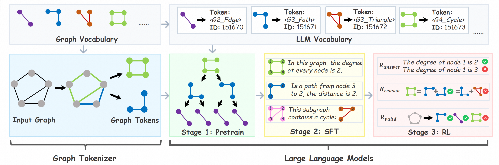
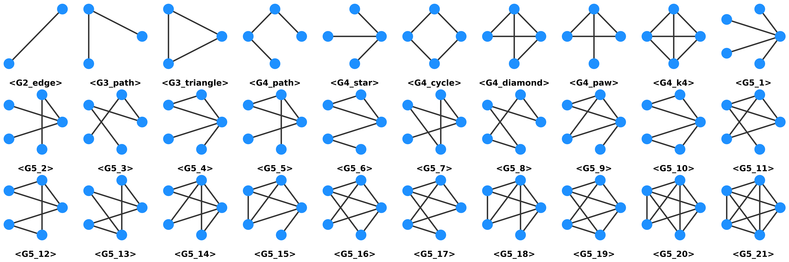

# GraphVulcan: Discrete Graph Tokenization for Structural Reasoning in Large Language Models

[](https://doi.org/10.1145/3770855.3818177)
[](https://creativecommons.org/licenses/by/4.0/)

> **Towards Next Graph Token Prediction: Discrete Graph Tokenization for Structural Reasoning in Large Language Models**
>
> Zhonghao Wang, Yugang Ji, Zhuonan Zheng, Sheng Zhou*, Weigao Wen, Minghao Li, Ming Gu, Zhiyao Zhou, Jiajun Bu
>
> *Zhejiang University & Alibaba Group*
>
> Accepted at the 32nd ACM SIGKDD Conference on Knowledge Discovery and Data Mining (KDD 2026)

## Overview

**GraphVulcan** introduces a novel framework that enables LLMs to perform **next graph token prediction** through reversible, discrete, and semantic-rich graph tokenization based on canonical graphlets.

<p align="center">
  
</p>

## Three-Stage Training Paradigm

| Stage | Description | Script |
|-------|-------------|--------|
| **Stage 1**: Structural Semantic Pretraining | Learn graphlet compositionality via decomposition & merge tasks | `train_s1.py` |
| **Stage 2**: Multi-task SFT | Fine-tune on 7 graph reasoning tasks with CoT annotations | `train_s2.py` |
| **Stage 3**: Reinforcement Learning (GRPO) | Explore diverse reasoning paths with multi-component rewards | `train_s3.py` |

## Graph Vocabulary

The vocabulary comprises all **30 connected non-isomorphic graphlets** with node count 2 ≤ k ≤ 5, as well as special graph tokens:

<p align="center">
  
</p>

## Supported Tasks

We evaluate on **7 fundamental graph reasoning tasks** spanning different computational complexity:

| Complexity | Task | Description |
|-----------|------|-------------|
| **P** | Connectivity | Determine if two nodes are connected |
| **P** | Cycle Detection | Detect whether a graph contains a cycle |
| **P** | Degree Calculation | Compute the degree of a target node |
| **P** | Shortest Path | Find the shortest path length between two nodes |
| **NP** | Graph Isomorphism | Determine if two graphs are isomorphic |
| **NP-Complete** | Maximum Clique | Find the largest complete subgraph |
| **NP-Complete** | Maximum Common Subgraph | Find the largest common subgraph of two graphs |

## Project Structure

```
GraphVulcan/
├── graph_vocab/                  # Core: Graph vocabulary & tokenizer
│   ├── graph_vocabulary.py       #   Canonical graphlet vocabulary (30 tokens)
│   └── graph_tokenizer.py        #   Structure-aware greedy tokenizer
├── gen_data/                     # Data generation scripts
│   ├── gen_data_stage1.py        #   Stage 1: Decomposition & merge data
│   ├── gen_data_connectivity.py  #   Stage 2: Connectivity task
│   ├── gen_data_cycle_dectection.py  # Stage 2: Cycle detection task
│   ├── gen_data_degree.py        #   Stage 2: Degree calculation task
│   ├── gen_data_shortest_path.py #   Stage 2: Shortest path task
│   ├── gen_data_isomorphism.py   #   Stage 2: Isomorphism task
│   ├── gen_data_max_clique.py    #   Stage 2: Maximum clique task
│   ├── gen_data_max_common_subgraph.py  # Stage 2: MCS task
│   ├── gen_data_graph_classification.py # Graph classification data
│   └── gen_data_single_task.sh   #   Helper: generate data for one task
├── train_s1.py                   # Stage 1 training
├── train_s2.py                   # Stage 2 training (joint SFT)
├── train_s3.py                   # Stage 3 training (GRPO)
├── inference.py                  # Model inference
├── evaluate/                     # Evaluation & reward functions
├── scripts/                      # Training & benchmark launch scripts
│   ├── stage1_train/             #   Stage 1 training scripts
│   ├── stage2_train/             #   Stage 2 training scripts
│   ├── stage3_train/             #   Stage 3 training scripts
│   └── benchmark_sh/            #   Benchmark evaluation scripts
├── gen_data_s1.sh                # Generate Stage 1 data
├── gen_data_s2_s3.sh             # Generate Stage 2 & 3 data
├── run_benchmark.sh              # Run evaluation on all 7 tasks
├── ds_config/                    # DeepSpeed configurations
└── utils/                        # Utility functions
```

## Download

### Dataset

The training and evaluation data is hosted on Hugging Face:

```bash
# Install Git LFS (required for large files)
git lfs install

# Clone the dataset repository
git clone https://huggingface.co/datasets/alibaba-behavioral-risk-control/GraphVulcan-Data

# Or load directly in Python
from datasets import load_dataset
dataset = load_dataset("alibaba-behavioral-risk-control/GraphVulcan-Data")
```

### Model Checkpoints

We release two model checkpoints:

| Model | Description | Link |
|-------|-------------|------|
| **GraphVulcan-SFT** | After Stage 2 multi-task supervised fine-tuning | [🤗 HuggingFace](https://huggingface.co/alibaba-behavioral-risk-control/GraphVulcan-SFT) |
| **GraphVulcan-GRPO** | After Stage 3 GRPO reinforcement learning | [🤗 HuggingFace](https://huggingface.co/alibaba-behavioral-risk-control/GraphVulcan-GRPO) |

```bash
# Download via Git
git lfs install
git clone https://huggingface.co/alibaba-behavioral-risk-control/GraphVulcan-SFT
git clone https://huggingface.co/alibaba-behavioral-risk-control/GraphVulcan-GRPO

# Or load directly in Python
from transformers import AutoModelForCausalLM, AutoTokenizer

model_name = "alibaba-behavioral-risk-control/GraphVulcan-SFT"  # or GraphVulcan-GRPO
tokenizer = AutoTokenizer.from_pretrained(model_name)
model = AutoModelForCausalLM.from_pretrained(model_name, torch_dtype="bfloat16", device_map="auto")
```

## Getting Started

### Installation

```bash
pip install torch transformers trl datasets networkx
pip install deepspeed bitsandbytes
```

### Data Generation

```bash
# Stage 1: Decomposition & merge data
bash gen_data_s1.sh

# Stage 2 & 3: Graph reasoning tasks data
bash gen_data_s2_s3.sh

# Or generate data for a specific task
bash gen_data/gen_data_single_task.sh connectivity
bash gen_data/gen_data_single_task.sh shortest_path
```

### Training

```bash
# Stage 1: Structural Semantic Pretraining
python train_s1.py \
    --base_model_path Qwen/Qwen3-8B \
    --dmc_dataset_path data/stage1/GraphVocab_Stage1_DMC_Relabels-15_MaxNodes-5_Train.jsonl \
    --extend_graph_vocab 1

# Stage 2: Multi-task SFT
deepspeed --num_gpus 4 train_s2.py \
    --model_path model/GraphVulcan-Stage1 \
    --encoding GraphVocab \
    --cot \
    --deepspeed ds_config/ds_config_zero2_4xH20_Qwen3-8B.json

# Stage 3: GRPO Reinforcement Learning
deepspeed --num_gpus 8 train_s3.py \
    --model_path model/GraphVulcan-SFT \
    --deepspeed ds_config/ds_config_zero3_8xH20_Qwen3-8B.json
```

Pre-configured launch scripts are available in `scripts/`:
```bash
bash scripts/stage1_train/run_train_s1_local.sh
bash scripts/stage2_train/run_train_s2_joint_sft_local.sh
bash scripts/stage3_train/run_train_s3_grpo_local.sh
```

### Evaluation

```bash
# Evaluate on all 7 tasks
bash run_benchmark.sh <model_path> GraphVocab <num_splits> <num_samples> [batch_size]

# Single-task inference
python inference.py --model_path <model_path> --encoding GraphVocab --task connectivity
```

Pre-configured benchmark scripts:
```bash
bash scripts/benchmark_sh/run_benchmark_graphvocab.sh
bash scripts/benchmark_sh/run_benchmark_edgelist.sh
bash scripts/benchmark_sh/run_benchmark_incident.sh
```

## Quick Example: Graph Tokenization

```python
import networkx as nx
from graph_vocab.graph_tokenizer import GraphTokenizer

tokenizer = GraphTokenizer()

# Create a sample graph
G = nx.karate_club_graph()

# Encode graph to GraphVocab token sequence
token_text = tokenizer.encode_graph_vocab(G)
print("GraphVocab tokens:", token_text)

# Decode back to graph (fully reversible)
G_decoded = tokenizer.decode_graph_vocab(token_text)
assert nx.is_isomorphic(G, G_decoded)
```

## Citation

```bibtex
@inproceedings{GraphVulcan2026,
  title={Towards Next Graph Token Prediction: Discrete Graph Tokenization for Structural Reasoning in Large Language Models},
  author={Wang, Zhonghao and Ji, Yugang and Zheng, Zhuonan and Zhou, Sheng and Wen, Weigao and Li, Minghao and Gu, Ming and Zhou, Zhiyao and Bu, Jiajun},
  booktitle={Proceedings of the 32nd ACM SIGKDD Conference on Knowledge Discovery and Data Mining},
  year={2026},
  doi={10.1145/3770855.3818177}
}
```

## Acknowledgments

This work was supported by the National Natural Science Foundation of China (No. 62476245) and Alibaba Group through Alibaba Innovative Research Program.

## Disclaimer

All code in this repository was originally developed on Alibaba's internal infrastructure. This is a modified public release. We have made our best effort to improve the generality and portability of the code, but potential issues may still exist as they have not been rigorously tested in external environments. We will continue to improve the code quality in future updates.
